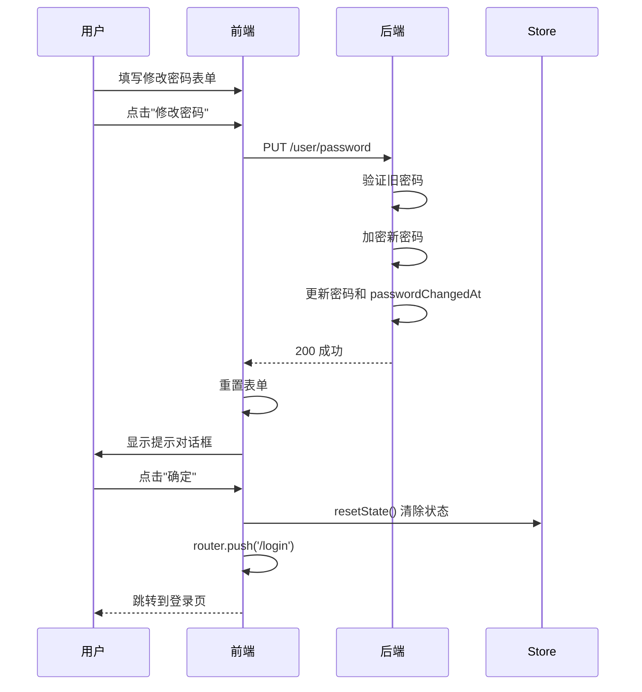
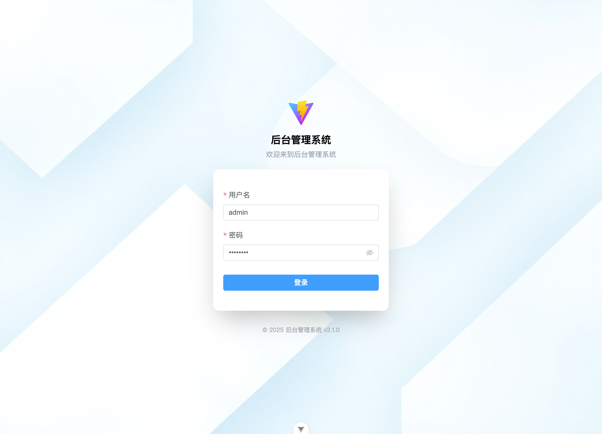

# 修改密码后强制重新登录功能

## 📋 需求背景

为了增强系统安全性，当用户修改密码后，应该强制用户重新登录，确保：
1. 旧的 token 立即失效
2. 防止他人在用户修改密码后继续使用已登录的会话
3. 提供更好的安全提示和用户体验

## 🔧 技术实现

### 修改的文件
**文件路径**: `apps/admin/src/views/user/components/PasswordChange.vue`

### 实现方案

#### 1. 导入必要的依赖
```typescript
import { useUserStore } from '@/stores/user'
import { useRouter } from 'vue-router'
import { ElMessageBox } from 'element-plus'
```

#### 2. 获取 Store 和 Router 实例
```typescript
const userStore = useUserStore()
const router = useRouter()
```

#### 3. 修改密码成功后的处理逻辑
```typescript
async function handleSubmit() {
  await validate(changePassword)
  reset()
  
  // 密码修改成功后，提示用户并跳转到登录页
  await ElMessageBox.alert('密码已修改成功，请重新登录', '提示', {
    confirmButtonText: '确定',
    type: 'success',
    callback: () => {
      userStore.resetState()  // 清除用户状态（token、userInfo等）
      router.push('/login')    // 跳转到登录页
    }
  })
}
```

## 🎯 功能流程



## ✅ 测试验证

### 测试环境
- 前端：http://localhost:5173
- 后端：http://localhost:3000

### 测试步骤
1. ✅ 登录系统（用户名：admin，密码：admin123）
2. ✅ 访问个人中心 `/user/profile`
3. ✅ 切换到"修改密码" Tab
4. ✅ 填写表单：
   - 旧密码：admin123
   - 新密码：newpassword123
   - 确认密码：newpassword123
5. ✅ 点击"修改密码"按钮

### 测试结果
1. ✅ **网络请求成功**
   - `PUT /user/password` 返回 200
   - 后端成功更新密码和 passwordChangedAt

2. ✅ **显示提示对话框**
   - 标题：提示
   - 内容：密码已修改成功，请重新登录
   - 按钮：确定
   - 类型：success (成功样式)

3. ✅ **点击确定后**
   - 用户状态被清除（token、userInfo、permissions）
   - 页面自动跳转到登录页 `/login`
   - URL 显示：http://localhost:5173/login

4. ✅ **重新登录验证**
   - 使用旧密码（admin123）登录失败
   - 使用新密码（newpassword123）登录成功
   - 确认密码已成功修改

## 🔐 安全特性

### 1. 立即清除本地状态
- 清除 localStorage 中的 token
- 清除 userInfo 信息
- 清除 permissions 权限列表

### 2. 后端 Token 失效机制
- 更新 `passwordChangedAt` 字段
- JWT 验证时检查 token 签发时间是否早于密码修改时间
- 如果早于，则 token 自动失效

### 3. 用户体验优化
- 友好的提示信息
- 成功样式的对话框
- 自动跳转，无需手动操作

## 📸 界面截图

修改密码后的提示对话框：



## 🆚 对比：修改前后

### 修改前
```typescript
async function handleSubmit() {
  await validate(changePassword)
  reset()  // ❌ 只是重置表单，用户仍保持登录状态
}
```

**问题**：
- ❌ 用户修改密码后仍保持登录状态
- ❌ 旧的 token 在本地仍然有效（虽然后端会拒绝）
- ❌ 可能造成用户困惑（为什么修改密码后还能继续使用？）

### 修改后
```typescript
async function handleSubmit() {
  await validate(changePassword)
  reset()
  
  // ✅ 提示用户并强制重新登录
  await ElMessageBox.alert('密码已修改成功，请重新登录', '提示', {
    confirmButtonText: '确定',
    type: 'success',
    callback: () => {
      userStore.resetState()
      router.push('/login')
    }
  })
}
```

**优势**：
- ✅ 立即清除本地状态，防止旧 token 残留
- ✅ 强制用户重新登录，确保使用新密码
- ✅ 清晰的安全提示，用户体验更好
- ✅ 符合安全最佳实践

## 📚 相关文档

- [用户个人中心功能](./USER_PROFILE.md)
- [功能调试修复记录](./USER_PROFILE_FIXES.md)
- [调试总结报告](./DEBUG_SUMMARY.md)

## 🎉 完成状态

- ✅ 功能已实现
- ✅ 代码已提交
- ✅ 测试已通过
- ✅ 文档已更新
- ✅ 截图已保存

---

**更新时间**: 2025年10月11日  
**测试状态**: 通过 ✅  
**安全等级**: 高 🔐

